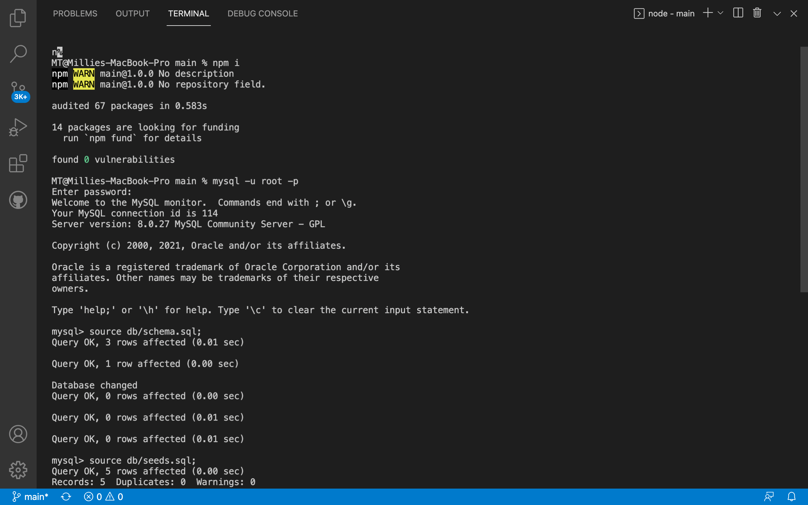
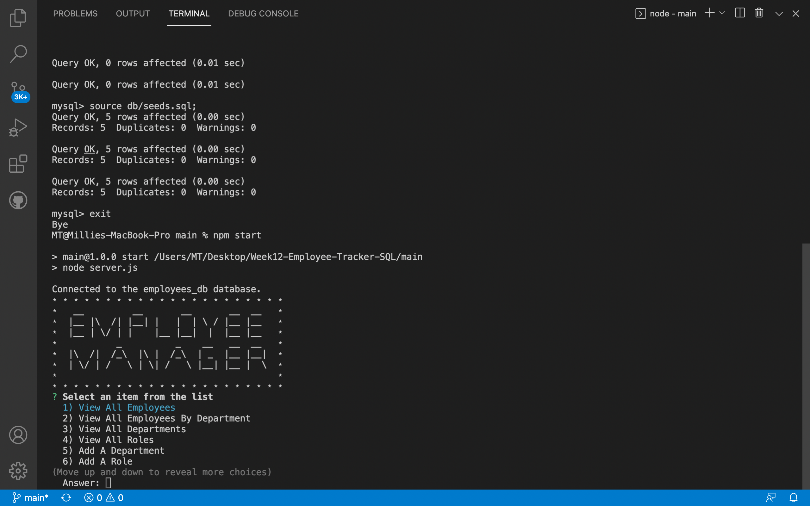

# 12 Employee Tracker

## Description

Created an interfaces that allow non-developers to easily view and interact with information stored in databases. These interfaces are called **content management systems (CMS)**. Built a command-line application from scratch to manage a company's employee database, using Node.js, Inquirer, and MySQL.

## User Story

```md
AS A business owner
I WANT to be able to view and manage the departments, roles, and employees in my company
SO THAT I can organize and plan my business
```

## Acceptance Criteria

```md
GIVEN a command-line application that accepts user input
WHEN I start the application
THEN I am presented with the following options: view all departments, view all roles, view all employees, add a department, add a role, add an employee, and update an employee role
WHEN I choose to view all departments
THEN I am presented with a formatted table showing department names and department ids
WHEN I choose to view all roles
THEN I am presented with the job title, role id, the department that role belongs to, and the salary for that role
WHEN I choose to view all employees
THEN I am presented with a formatted table showing employee data, including employee ids, first names, last names, job titles, departments, salaries, and managers that the employees report to
WHEN I choose to add a department
THEN I am prompted to enter the name of the department and that department is added to the database
WHEN I choose to add a role
THEN I am prompted to enter the name, salary, and department for the role and that role is added to the database
WHEN I choose to add an employee
THEN I am prompted to enter the employee’s first name, last name, role, and manager, and that employee is added to the database
WHEN I choose to update an employee role
THEN I am prompted to select an employee to update and their new role and this information is updated in the database
```

## Design concept

Designed the database schema as shown in the following image:


As the image illustrates, the schema should contain the following three tables:

- `department`

  - `id`: `INT PRIMARY KEY`

  - `name`: `VARCHAR(30)` to hold department name

- `role`

  - `id`: `INT PRIMARY KEY`

  - `title`: `VARCHAR(30)` to hold role title

  - `salary`: `DECIMAL` to hold role salary

  - `department_id`: `INT` to hold reference to department role belongs to

- `employee`

  - `id`: `INT PRIMARY KEY`

  - `first_name`: `VARCHAR(30)` to hold employee first name

  - `last_name`: `VARCHAR(30)` to hold employee last name

  - `role_id`: `INT` to hold reference to employee role

  - `manager_id`: `INT` to hold reference to another employee that is the manager of the current employee (`null` if the employee has no manager)

## Advanced feature

Added some additional features to the application, as following:

- Update employee managers.

- View employees by department.

- Delete departments, roles, and employees.

## License

[](https://opensource.org/licenses/MIT)

### Walkthrough Video

- Open Employee tracker from Terminal (Please click screenshot to watch the video)
  [](https://drive.google.com/file/d/1ARiPZ4P5wPCgxR6MtWDHodyC0Up5KCYe/view?usp=sharing)

- Demo Employee Tracker (Please click screenshot to watch the video)
  [](https://drive.google.com/file/d/1-SPfCw8LxdQFLxewsX-9nhrZvBSCuB-G/view?usp=sharing)

### Technology used

- Uses the [Inquirer package](https://www.npmjs.com/package/inquirer).

- Uses the [MySQL2 package](https://www.npmjs.com/package/mysql2) to connect to a MySQL database.

- Uses the [console.table package](https://www.npmjs.com/package/console.table) to print MySQL rows to the console.

---

© 2021 Trilogy Education Services, LLC, a 2U, Inc. brand. Confidential and Proprietary. All Rights Reserved.
